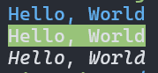
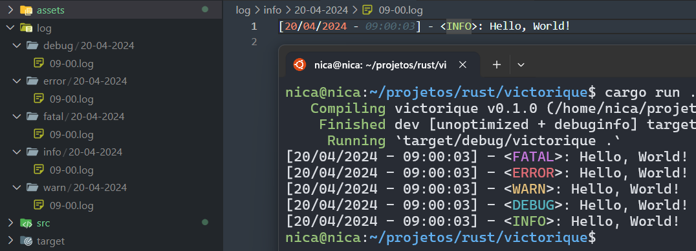

<h1 align="center">Victorique - Utils</h1>
<p align="center">
  
</p>

* **Victorique** é um projeto simples com coisa **utils** que eu irei usar em meu projetos.
* Comecei a estudar **Rust** no meu tempo livro e decidi criar pequenos projetos para eu pegar o básico de **Rust**.
O intuito dessa **lib** e com base na experiência que eu adquirir trabalhado com **Rust**, acabar criando **libs** melhores é maiores.
* Eu sou uma pessoa que gosta de criar as próprias **libs**, e enquanto eu não encontro um trabalho na área, eu decidir criar algumas **libs** para eu obter mais experiência com **Rust**.
* Poderia ter usado as **libs** da comunidade quem são melhores é mais incriveis? Sim, porém, eu quero aprender mais sobre **Rust**, e esse é o meu jeitinho de aprender.

<h1 align="center">Libs</h1>

* **Colorize** - De uma cor para seu terminal enquanto crie seus projetos.
```rust
use victorique::utils::terminal::Colorize;

fn main() {
    let text: &str = "Hello, World";
    println!("{}", text.blue());
    println!("{}", text.bg_green());
    println!("{}", text.italic());
}
```


* **Log** - Um sistema de Log simples que ainda está em construção.
```rust
use victorique::logger::terminal::{Constructor, Logger};

fn main() {
    Logger.fatal("Hello, World!");
    Logger.error("Hello, World!");
    Logger.warn("Hello, World!");
    Logger.debug("Hello, World!");
    Logger.info("Hello, World!");
}
```

